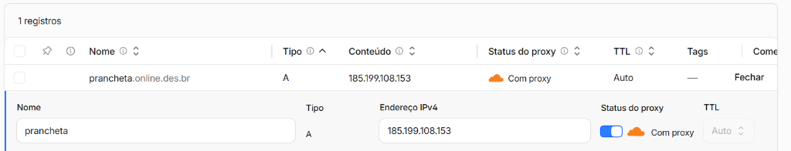

# Publicação e Pitch de Vendas - Prancheta Digital

Parabéns pela publicação, Guilherme! O site https://prancheta.online.des.br/ está no ar e rodando liso. Esse é um marco gigante para usarmos como case de estudo no ecossistema WUXIA-OPS!

Para te ajudar a vender a Prancheta Digital para o Diretor e para o Vice-Diretor, preparei uma abordagem de vendas dividida pelos maiores "dores" de quem faz a gestão escolar: Segurança, Tempo/Eficiência e Decisões baseadas em Dados.

Aqui estão os argumentos de alto impacto que você pode apresentar a eles:

## 📋 Argumentos de Venda: Prancheta Digital Escola

### 1. Para o Diretor (Foco Estratégico, Reputação e Gestão de Risco)
"Diretor, a Prancheta Digital transforma a indisciplina e a segurança escolar de um sentimento subjetivo para dados reais e auditáveis."

* **Redução Drástica do Tempo de Resposta a Emergências:** Com o Terminal Isolado das Salas, os professores têm um canal direto de socorro. Em caso de brigas ou emergências médicas (botão GRAVE), a coordenação é notificada imediatamente via sistema e WhatsApp, mitigando riscos de tragédias ou processos judiciais para a escola.
* **Decisões Baseadas em Dados (Dashboard Executivo):** Em vez de relatórios em papel que se perdem, o diretor tem um painel em tempo real que mostra:
  * Quais os horários mais críticos de indisciplina (ajudando a remanejar monitores).
  * Quais são as salas ou locais (pátio, quadra, banheiros) que concentram 80% das ocorrências.
  * A eficiência da equipe de monitores na resolução dos chamados.
* **Fortalecimento da Relação com as Famílias:** Quando um pai é chamado na escola, a diretoria não usa mais achismos. Ela apresenta um relatório completo do histórico do aluno, com datas, horários, locais e reincidências exatas. Isso traz autoridade incontestável e profissionalismo à escola.
* **Conformidade Legal e Acessibilidade (A11y):** O sistema já está preparado para professores ou funcionários com deficiência visual ou baixa visão, contando com modos de alto contraste e zoom de interface nativos, blindando a escola em termos de inclusão e acessibilidade digital.

### 2. Para o Vice-Diretor / Coordenador Pedagógico (Foco na Operação e Rotina)
"Vice-Diretor, nós vamos zerar o papel, a burocracia e as 'corridas' pelos corredores para achar um monitor."

* **Fim da Burocracia com o Smart Paste (IA Local):** O monitor de pátio não precisa preencher formulários gigantescos. Ele pode simplesmente colar mensagens como: "Gabriel Oliveira do 8MB estava sem uniforme" e o sistema automaticamente identifica o aluno, vincula a ocorrência à turma, classifica a gravidade e cria o registro em 1 segundo.
* **Identificação Precoce de Alunos Reincidentes:** O sistema monitora a recorrência nos últimos 30 dias automaticamente. Se um aluno é pego repetidamente cometendo pequenas infrações (ex: celular em aula), o sistema alerta a coordenação antes que o problema escale para algo pior.
* **Auditoria e Histórico Confiáveis:** Cada ocorrência possui um log de auditoria interno e seguro que mostra exatamente quem registrou, quando foi alterado e como foi resolvido, evitando desentendimentos entre a equipe.
* **Exportação Rápida para Relatórios Oficiais (CSV):** Ao final do mês ou conselho de classe, o vice-diretor exporta todas as ocorrências filtradas com apenas um clique para anexar ao histórico pedagógico ou enviar para a secretaria de educação.

### 💡 Dica de Apresentação (O Gancho Comercial)
Para fechar o negócio, você pode propor um piloto sem fricção:

> "Diretor/Vice, o sistema já está publicado e pronto para uso no link https://prancheta.online.des.br/. Vamos fazer um teste piloto de 15 dias em duas salas mais complexas e no pátio? Eu garanto que a comunicação vai ficar mais silenciosa, rápida e vocês terão um mapeamento das indisciplinas que nunca tiveram antes."

---

## 🚀 Tutorial Técnico: Configurando Subdomínio no GitHub Pages via Cloudflare

Este guia documenta o passo a passo de infraestrutura utilizado para colocar o projeto no ar no link oficial. 

**Referência Oficial do GitHub:**  
[Configuring a custom domain for your GitHub Pages site](https://docs.github.com/pt/pages/configuring-a-custom-domain-for-your-github-pages-site/managing-a-custom-domain-for-your-github-pages-site)

### Passo 1: Configuração de DNS (Cloudflare)

Para conectar o subdomínio `prancheta.online.des.br` aos servidores do GitHub Pages, é necessário criar registros do tipo **A** apontando para os IPs oficiais do GitHub.

Os endereços IP do GitHub Pages são:
- `185.199.108.153`
- `185.199.109.153`
- `185.199.110.153`
- `185.199.111.153`

> No painel do Cloudflare:
> 1. Vá em **DNS > Registros**.
> 2. Adicione um registro do tipo `A`.
> 3. Em **Nome**, insira `prancheta` (o seu subdomínio).
> 4. Em **Endereço IPv4**, insira o primeiro IP: `185.199.108.153`.
> 5. Certifique-se de que a nuvem laranja (Proxy) está ativada.
> 6. Salve o registro.

**Referência Visual (Configuração no Cloudflare):**  
  

### Passo 2: Vinculação no GitHub Pages

Após o DNS ser propagado, informe ao repositório do GitHub que ele deve responder por esse domínio.

> No painel do GitHub:
> 1. Acesse o repositório `CA_prancheta_digital`.
> 2. Vá na aba **Settings** (Configurações).
> 3. No menu lateral esquerdo, clique em **Pages**.
> 4. Na seção **Custom domain**, digite: `prancheta.online.des.br`.
> 5. Clique em **Save**.
> 6. O GitHub fará uma checagem de DNS. Quando a validação ocorrer com sucesso, a mensagem "DNS check successful" será exibida.

**Referência Visual (Painel do GitHub Pages):**  
  

### Passo 3: Segurança (SSL / HTTPS)

**Importante:** Se você estiver utilizando o proxy ativo no Cloudflare (nuvem laranja), a mensagem "Domain is not eligible for HTTPS at this time" no GitHub pode aparecer, mas isso é **normal**. 

O Cloudflare fornecerá o certificado SSL (cadeado seguro) automaticamente para os visitantes. Certifique-se apenas de que a opção de criptografia no painel do Cloudflare esteja marcada como **Full (Completo)** ou **Flexible (Flexível)**.
