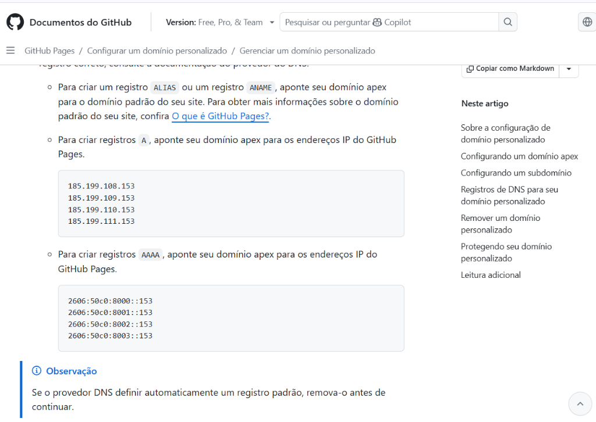
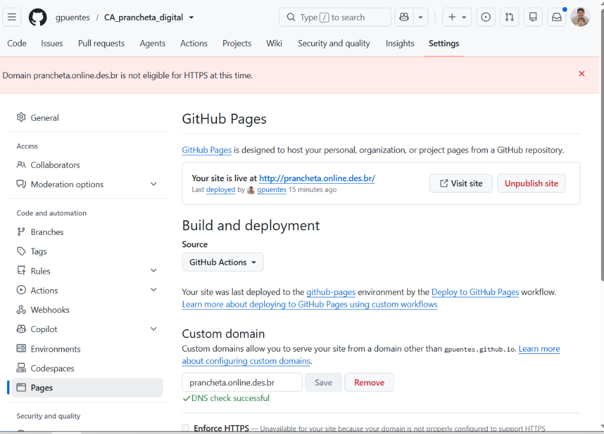

# Curso WUXIA Ops: Criação de um PWA Enterprise do Zero à Nuvem

Este material é um registro passo a passo ("Documentation as Code") das decisões e implementações do projeto **CA Prancheta Digital**. Ele serve como um guia entregável para novos membros da equipe e como material oficial do curso WUXIA Ops.

---

## Módulo 1: Setup da Inteligência e Arquitetura Inicial
Nesta fase, utilizamos um Agente IA Sênior (Gepto) para atuar como Product Manager e Tech Lead.

1. **Definição da Stack (WUXIA-OPS):**
   - Frontend: Vite + React + Fluent UI 2.
   - Backend Futuro: PostgreSQL + PGVector.
   - Orquestração: n8n + Automação de WhatsApp.

2. **Criação do Repositório e Higiene:**
   - Inicializamos o repositório Git.
   - Configuramos o `.gitignore` para blindar arquivos de rascunho de IA (`*.txt`, `pasta_docs/`) evitando o vazamento de propriedade intelectual antes da fase "Documentation as Code".

## Módulo 2: O Frontend com Fluent UI 2
1. O ambiente base foi gerado com `npm run dev` usando **Vite**.
2. Foi diagnosticado um erro de dependência do React, e nós resolvemos usando `npm install -D @vitejs/plugin-react --legacy-peer-deps` para forçar a compatibilidade de bibliotecas corporativas.

## Módulo 3: Infraestrutura, Deploy e Automação GitHub Actions
Para garantir integração contínua sem depender de setups locais complexos:
1. Criamos um workflow do GitHub Actions em `.github/workflows/deploy.yml`.
2. O workflow escuta a branch `main`, instala as dependências via Node 20, compila o código e envia automaticamente a pasta `dist` para o **GitHub Pages**.

## Módulo 4: Estratégia de Auditoria e "Heatmaps" (Poder do Super Admin)
No nível Enterprise, gestores precisam de dados não verbais:
1. Em vez de criar um sistema complexo do zero, planejamos a injeção do **Microsoft Clarity / PostHog**.
2. Ele roda no background invisível para o usuário final, mas grava sessões completas da tela para o UX e Super Admin estudarem gargalos de uso dos inspetores.

## Módulo 5: Documentation as Code (DaC)
Adotamos a cultura de manter a documentação colada ao código fonte (`/docs/`), espelhando métodos ágeis (DDD, BDD, TDD).
1. `product/prd.md` -> A essência do produto.
2. `ux-ui/styleguide.md` -> Regras visuais (Fluent 2).
3. `architecture/sdd.md` -> Diagramas e stack.

## Módulo 6: Configuração de Domínio Personalizado (Cloudflare & GitHub Pages)
Para publicar a aplicação em produção sob um domínio corporativo personalizado (como `prancheta.online.des.br`):

1. **Configuração de DNS no Cloudflare (ou outro provedor):**
   - Crie 4 registros do tipo **A** apontando para os IPs oficiais do GitHub Pages:
     - `185.199.108.153`
     - `185.199.109.153`
     - `185.199.110.153`
     - `185.199.111.153`
   - Opcionalmente, você pode adicionar registros **AAAA** (IPv6):
     - `2606:50c0:8000::153`
     - `2606:50c0:8001::153`
     - `2606:50c0:8002::153`
     - `2606:50c0:8003::153`
   
   
   
   

2. **Configuração de Domínio Personalizado no GitHub Pages:**
   - Acesse as **Settings** do seu repositório no GitHub.
   - Vá na seção **Pages** na barra lateral.
   - Sob **Custom domain**, insira o seu domínio completo (ex: `prancheta.online.des.br`) e clique em **Save**.
   - O GitHub fará uma verificação de DNS. Quando bem-sucedida, o site estará ativo.
   - *Nota:* Ative a opção **Enforce HTTPS** assim que o certificado SSL for provisionado pelo GitHub (pode demorar alguns minutos após a propagação do DNS).

   

3. **Links de Referência:**
   - [Documentação do GitHub: Configurar um domínio personalizado](https://docs.github.com/pt/pages/configuring-a-custom-domain-for-your-github-pages-site)
   - [Documentação do GitHub: Gerenciar um domínio personalizado](https://docs.github.com/pt/pages/configuring-a-custom-domain-for-your-github-pages-site/managing-a-custom-domain-for-your-github-pages-site)

